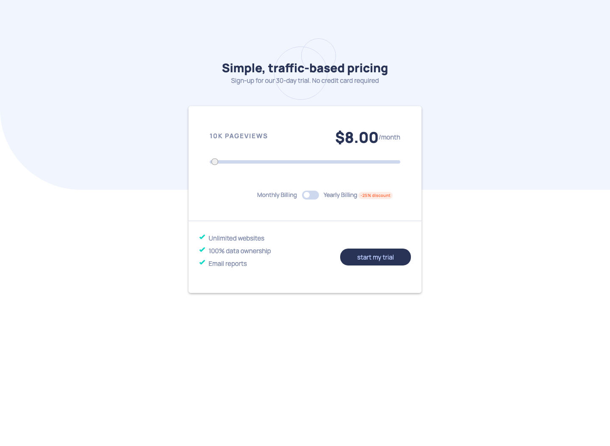

# Frontend Mentor - Interactive pricing component solution

This is a solution to the [Interactive pricing component challenge on Frontend Mentor](https://www.frontendmentor.io/challenges/interactive-pricing-component-t0m8PIyY8). Frontend Mentor challenges help you improve your coding skills by building realistic projects.

## Table of contents

- [The challenge](#the-challenge)
- [Screenshot](#screenshot)
- [Links](#links)
- [Built with](#built-with)
- [What I learned](#what-i-learned)
- [Continued development](#continued-development)
- [Useful resources](#useful-resources)
- [Author](#author)
- [Acknowledgments](#acknowls)

### The challenge

Users should be able to:

- View the optimal layout for the app depending on their device's screen size
- See hover states for all interactive elements on the page
- Use the slider and toggle to see prices for different page view numbers

### Screenshot

### Links

- Solution URL: [Add solution URL here](https://your-solution-url.com)
- Live Site URL: [Add live site URL here](https://adedejiadelanwa.github.io/interactive-pricing-component/)

### Built with

- Semantic HTML5 markup
- CSS custom properties
- Flexbox
- Mobile-first workflow

### Continued development

- SVG and animation
- BEM
- CSS Pre-processors

### Useful resources

- [Stack-overflow](https://stackoverflow.com/questions/18389224/how-to-style-html5-range-input-to-have-different-color-before-and-after-slider) - The second answer (84 votes) on this thread really helped me in understanding how to change the progress colour on a range input element. I really liked this pattern and will use it going forward as it is clean and straight forward.

## Author

- Website - ['Deji Adelanwa](https://adedejiadelanwa.github.io/web-portfolio.github.io/)
- Frontend Mentor - [@Adasi_Jnr](https://www.frontendmentor.io/profile/AdedejiAdelanwa)
- LinkedIn - [Adedeji Adelanwa](https://www.linkedin.com/adedejiadelanwa)

## Acknowledgments

- Shout out to - [Qausim Yussuf](https://github.com/Qausim)
